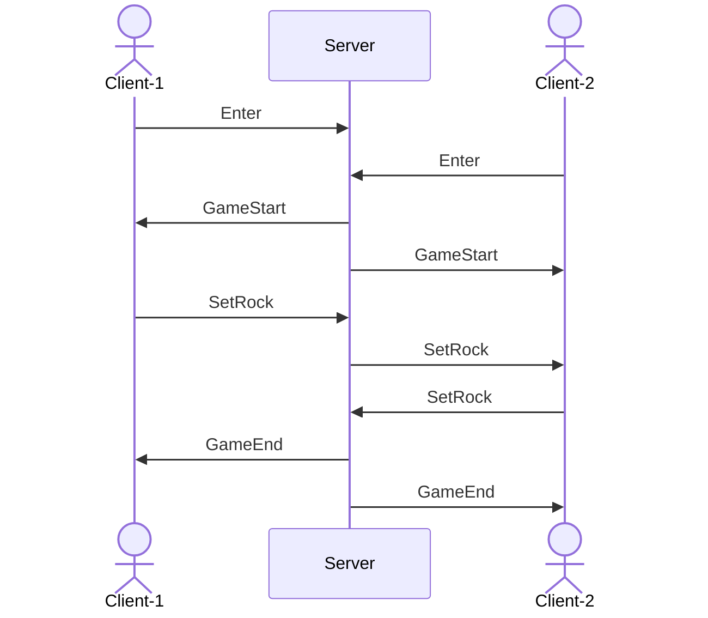

<!-- PROJECT LOGO -->
 

  
  <h3 align="center">C# GAME SERVER</h3>
  

    Socket 통신 오목 게임 서버 샘플 프로젝트 
    2025.08.04 ~ 2025.8.07 (4일 진행)
  

## Roadmap

- [x] Step 1 SuperSocketLite 학습 및 프로젝트 생성 (8/4)

  - [x] VS Code + .NET 개발 환경 세팅
  - [x] GitHub 저장소 생성 및 연동
  - [x] `.gitignore` 설정 및 기본 정리
  - [x] SuperSocketLite 구조 분석 (`AppServer`, `AppSession`, `RequestInfo`)
  - [x] `EchoServer` 샘플 실행 성공
  - [x] `EchoClient` 샘플 실행 성공

- [x] Step 2 Echo 서버 및 클라이언트 개발 (8/4)

  - [x] Echo 서버 프로젝트 구조 설계 (`EchoSession`, `EchoReceiveFilter`)
  - [x] 텍스트 수신 → 그대로 응답하는 기본 구현
  - [x] 클라이언트 콘솔 앱 제작
  - [x] Echo 기능 동작 확인 (멀티 접속 포함)
  - [x] 로그 및 에러 처리 추가
  - [x] README 작성

- [x] Step 3 오목 서버 개발 (8/5~8/6)

  - [x] 오목 플레이어 세션 관리 (`GomokuSession`)
  - [x] 좌표 송수신 프로토콜 설계 (예: `PUT x y`)
  - [x] 게임 상태 저장 및 룰 검증 (`GomokuGameRoom`)
  - [x] 콘솔 클라이언트에서 플레이 테스트 가능하도록 구현
  - [x] 승패 판단 및 게임 종료 로직
  - [x] README 작성

- [ ] Step 4 오목 클라이언트 개발 (8/7)

  - [x] WFP 기반 오목 클라이언트 제작
  - [ ] 명령어 입력 및 보드 출력 구현
  - [x] 클라이언트 간 통신 테스트 (2인 대전 시뮬레이션)
  - [ ] 리팩토링 및 코드 정리
  - [ ] README 작성

- [ ] 선택 과제 (시간 여유 있을 시)

  - [ ] 오목 API 서버 제작 (예: 매칭 대기열 관리용 REST API)
  - [ ] 오목 매칭 서버 별도 구성 (`MatchServer`)

<!-- force spacing --> 
&nbsp
 
&nbsp
 
     

## Echo Server

### EchoServer
- [원본](https://github.com/jacking75/dotnetconf_2023_SuperSocketLite_handson/tree/main/EchoServer)에서 불필요한 코드를 걷어냈습니다.
- C# 콘솔 기반 TCP 서버
- 클라이언트로부터 받은 메시지를 그대로 다시 돌려주는 에코 기능
- SuperSocket 기반 확장 가능 구조

### EchoClient
- [원본](https://github.com/jacking75/dotnetconf_2023_SuperSocketLite_handson/tree/main/EchoClient)과 완전히 동일합니다.
- winform 형태의 TCP 클라이언트
- 메시지를 서버에 전송하고 응답을 출력

### EchoWpfBlazorClient
- WPF 애플리케이션에 Blazor WebView를 임베딩한 UI 클라이언트
- 서버와 TCP 연결, 문자열 전송 및 수신 로그 확인 가능
- 로그 상태는 Redux 패턴을 모방하여 DI 기반 `LogStore`를 통해 전역 관리
- `ServerClient`는 DI로 관리되며 `LogStore`와 연결되어 자동 렌더링 갱신

<!-- force spacing --> 
&nbsp
 
&nbsp
 
     

## Gomoku Server

### GomokuServer
- EchoServer를 템플릿으로, 기능을 확장
- SuperSocketLite 기반의 C# TCP 서버
- 클라이언트 간 오목 대전을 위한 방 시스템 및 사용자 관리 기능 포함
- SuperSocketLite의 `AppServer<TSession, TRequestInfo>`를 상속한 `MainServer`가 중심 역할
- 패킷 수신은 비동기적으로 처리되며, 실제 처리 로직은 `PacketProcessor`의 싱글 스레드에서 순차적으로 수행
- 구조적으로 안정성과 순서를 보장하는 싱글 스레드 큐 기반 처리 방식

### GomokuProtocol
- 클라이언트와 서버 간 통신에 사용되는 공통 패킷 정의 모음
- `MemoryPack`을 사용한 직렬화 구조
- 패킷 ID와 패킷 본문으로 구성되는 바이너리 프로토콜을 기반으로 동작
- Request / Response 가 따로 없는 구조

### GomokuClient
- EchoWpfBlazorClient를 템플릿으로, 기능을 확장
- (추가 예정) 오목 게임 클라이언트

### 프로토콜 흐름

